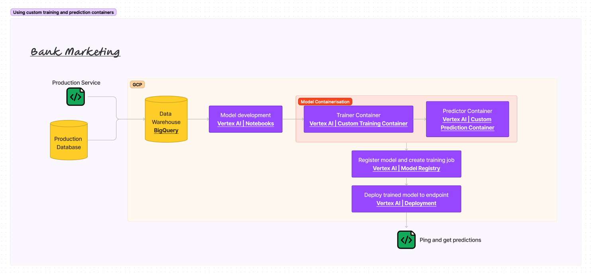

# Bank Marketing

Dataset Source: [Moro,S., Rita,P., and Cortez,P.. (2012). Bank Marketing. UCI Machine Learning Repository](https://doi.org/10.24432/C5K306).

This dataset is licensed under a [Creative Commons Attribution 4.0 International](https://creativecommons.org/licenses/by/4.0/legalcode) (CC BY 4.0) license.

# E2E Production ML



# Steps to productionize model on Vertex AI

From within the `trainer/` directory, we will first build our custom trainer docker image
```
export REGION=<your project region>
export PROJECT_ID=<your project id>
export REPO_NAME=<your image artifactory repository name>
export IMAGE_NAME=<name to give your trainer image>
export IMAGE_TAG=<tag to give your trainer image>
export IMAGE_URI={REGION}-docker.pkg.dev/${PROJECT_ID}/${REPO_NAME}/${IMAGE_NAME}:${IMAGE_TAG}

docker build -f Dockerfile -t ${IMAGE_URI} ./
```

Let's verify the container image by running it as a container locally
```
docker run ${IMAGE_URI}
```

If the local run works, you can push the container to Artifact Registry.
```
docker push ${IMAGE_URI}
```

Next, from inside the `predictor/` directory, run the `Dockerfile.ipynb` python notebook that will essentially also push the predictor container to artifact registry.

With both the trainer as well as predictor container images in place, you can import the model to model registry. To do so, you can follow the steps described at official Vertex AI [documentation](https://cloud.google.com/vertex-ai/docs/model-registry/import-model#import_a_model_using). Remember to select "import an existing custom container" for both training and prediction containers.

Upon doing this successfully, Vertex AI will import the model to the registry and will also start the training job.

When the training job finishes, you can follow the steps described at official Vertex AI [documentation](https://cloud.google.com/vertex-ai/docs/general/deployment#deploy_a_model_to_an_endpoint) to deploy a model to an endpoint. Deploying the model may take some minutes.

Once the model is deployed, then note the endpoint id and run the `ping_endpoint.ipynb` python notebook to send a payload to the endpoint and receive predictions.
